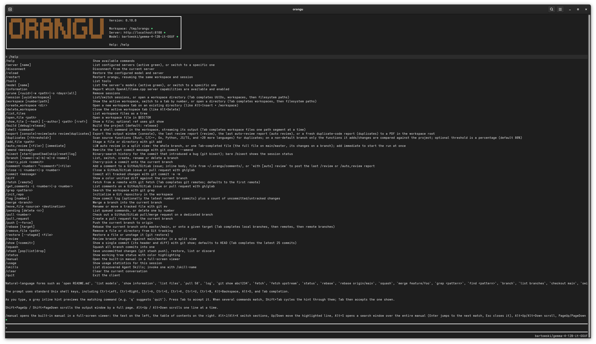

# orangu

**orangu** is a local workspace-aware tool-driven coding environment for **OpenAI-compatible** servers - especially **[llama.cpp](https://github.com/ggml-org/llama.cpp)**.

**orangu** **does not** require an Internet connection after **[llama.cpp](https://github.com/ggml-org/llama.cpp)** and models have been downloaded.

**orangu** is named after the [Orangutan](https://en.wikipedia.org/wiki/Orangutan) - the smartest ape.



## Table of Contents

- [Features](#features)
- [Installation](#installation)
  - [Install dependencies on Fedora](#install-dependencies-on-fedora)
  - [Release build](#release-build)
  - [Debug build](#debug-build)
- [Configuration and first run](#configuration-and-first-run)
- [Documentation](#documentation)
- [Tested platforms](#tested-platforms)
- [Sponsors](#sponsors)
- [Contributing](#contributing)
- [Community](#community)
- [License](#license)

## Features

- OpenAI-compatible chat completions, with special attention to llama.cpp workflows
- Workspace-aware local tools for reading, editing, listing, fetching, and shell commands
- Persistent terminal UI with workspace, server, and model status in the header, refreshed every minute while idle
- Shell-style prompt editing, history, scrolling, and context-sensitive Tab completion, with grey inline command hints (Tab accepts, Shift+Tab cycles between matches)
- Local commands such as `/help`, `/manual`, `/model`, `/server`, `/list_files`, `/show_file`, `/tools`, `/diff`, `/status`, `/log`, `/pull`, `/rebase`, `/merge`, `/checkout`, `/add_file`, `/remove_file`, `/move_file`, `/cherry_pick`, `/comment`, `/close`, `/get_comments`, `/commit`, `/amend`, `/push`, `/review`, `/auto_review`, `/export`, `/init_repo`, `/squash`, `/delete`, `/open_file`, and `/bisect`
- Natural-language local aliases such as `open README.md`, `list models`, `list files`, `pull 58`, `log`, `status`, `rebase`, `merge feature/foo`, `checkout main`, `add README.md`, `remove README.md`, `move old.rs new.rs`, `cherry pick abc1234`, `commit "[#42] My feature"`, `amend "[#42] My feature"`, `push`, `force push`, `get comments for issue 51`, `review`, `auto review`, `export review`, `init repo`, `squash`, `delete feature/foo`, `show manual`, and `show help`
- Export the output window or the last review report to a PDF in the workspace root (`/export console`, `/export review`), keeping the Markdown formatting and the orangu brand colour for the title and headings
- Streaming responses with live footer status such as `Thinking (...)` and llama.cpp-native `Working @ X.Y t/s (...)`
- Queued local commands while a response is in flight, plus double-`Esc` request cancellation
- Markdown rendering in the console, including bold, italic, headings, lists, links, and code
- Syntax highlighting for fenced code blocks in supported programming languages
- LLM-driven auto review (`/auto_review`) of the branch changes against main/master: the model reviews the whole change and each file by itself across the Overall, Code, Security, Memory, Performance, Test Suite, and Documentation categories plus a final Conclusion verdict (each file's extension enables the categories scanned — a file detected as documentation skips the code-related checks), marks each file with a green or red dot, shows the file, category, overall progress, and elapsed time in a status area at the top, and copies the report to the clipboard on exit
- Built-in user manual (`/manual`) in a `/review`-style two-pane viewer with full-text search (`Alt+S`) — the manual text is embedded in the binary at compile time, so it works offline

## Installation

### One-liner install (Linux, macOS, Windows)

**Linux / macOS** (requires `curl` or `wget`, and `tar`):

```sh
curl -fsSL https://raw.githubusercontent.com/mnemosyne-systems/orangu/main/install.sh | sh
```

**Windows** (requires PowerShell, included with Windows 10 and later):

```cmd
curl -fsSL https://raw.githubusercontent.com/mnemosyne-systems/orangu/main/install.cmd -o install.cmd && install.cmd
```

Both scripts download the latest release binary, install it to `~/.local/bin` (Linux/macOS) or `%USERPROFILE%\.local\bin` (Windows), and warn if the directory is not in your `PATH`.

**Custom install directory:** set `INSTALL_DIR` before running the script:

```sh
# Linux / macOS
curl -fsSL https://raw.githubusercontent.com/mnemosyne-systems/orangu/main/install.sh | INSTALL_DIR=/usr/local/bin sh
```

```cmd
:: Windows
set "INSTALL_DIR=C:\Tools" && install.cmd
```

**Shell completions:** after installing, run `orangu -s` to print the completion script for your shell:

```sh
# bash
orangu -s >> ~/.bashrc && source ~/.bashrc

# zsh
orangu -s >> ~/.zshrc && source ~/.zshrc

# fish
orangu -s | source
```

On Windows, add `Invoke-Expression (orangu -s)` to your PowerShell `$PROFILE`.

### Build from source

#### Install dependencies

**Fedora / RHEL:**

```sh
dnf install -y git rust cargo
```

**Debian / Ubuntu:**

```sh
apt-get install -y git curl
curl --proto '=https' --tlsv1.2 -sSf https://sh.rustup.rs | sh
```

**macOS:**

```sh
brew install rust
```

#### Release build

The following commands build an optimized release binary:

```sh
git clone https://github.com/mnemosyne-systems/orangu.git
cd orangu
cargo build --release
```

The binary will be available at:

```text
target/release/orangu
```

To install it system-wide:

```sh
sudo install -Dm755 target/release/orangu /usr/local/bin/orangu
```

#### Debug build

The following commands build a debug binary:

```sh
git clone https://github.com/mnemosyne-systems/orangu.git
cd orangu
cargo build
```

The binary will be available at:

```text
target/debug/orangu
```

## Configuration and first run

The quickest way to get a working configuration is the interactive wizard:

```sh
orangu --init
```

It asks for the **LLM URL**, auto-detects a model the server advertises (and
pre-fills it as the **Model**), then walks every option showing its default.
Anything left at its default is omitted from the file, and the result is shown
for confirmation before being written to `~/.orangu/orangu.conf` (creating the
directory if needed, and overwriting any existing file). The provider is
assumed to be [llama.cpp](https://github.com/ggml-org/llama.cpp).

Alternatively, start from the sample configuration:

```sh
cp doc/etc/orangu.conf ./orangu.conf
```

Default configuration lookup order:

1. `./orangu.conf`
2. `~/.orangu/orangu.conf`

Run the client:

```sh
orangu --config ./orangu.conf
```

Or run it directly from the build tree:

```sh
./target/release/orangu --config ./orangu.conf
```

By default, local tools operate on the current working directory. Use `--workspace /path/to/project` (`-w`) to point **orangu** at another tree.

The startup flags also have short forms: `-c` for `--config`, `-w` for `--workspace`, `-r` for `--resume`, and `-i` for `--init`.

Shell completion scripts (bash, zsh, fish) for these flags live in [`contrib/shell/`](contrib/shell/README.md).

Useful first commands:

```text
/help
/tools
/list_files
/open_file README.md
/show_file README.md
/amend "[#42] My feature"
/cherry_pick abc1234
/commit "[#42] My feature"
/delete feature/foo
/log
/log 5
/squash
/status
```

## Documentation

- [Latest manual](https://github.com/mnemosyne-systems/orangu/tree/main/doc/manual/en)
- [Getting Started](https://github.com/mnemosyne-systems/orangu/blob/main/doc/GETTING_STARTED.md)
- [Quick start](https://github.com/mnemosyne-systems/orangu/blob/main/doc/manual/en/03-quickstart.md)
- [Configuration](https://github.com/mnemosyne-systems/orangu/blob/main/doc/manual/en/20-configuration.md)
- [Terminal interface](https://github.com/mnemosyne-systems/orangu/blob/main/doc/manual/en/40-terminal.md)
- [Core tools](https://github.com/mnemosyne-systems/orangu/blob/main/doc/manual/en/41-core_tools.md)
- [Git tools](https://github.com/mnemosyne-systems/orangu/blob/main/doc/manual/en/42-git_tools.md)
- [Usage tools](https://github.com/mnemosyne-systems/orangu/blob/main/doc/manual/en/43-usage_tools.md)
- [Tools](https://github.com/mnemosyne-systems/orangu/blob/main/doc/manual/en/30-tools.md)

## Tested platforms

- [Fedora](https://getfedora.org/) 44

## Sponsors

- [mnemosyne systems](https://www.mnemosyne-systems.ai/)

## Contributing

Contributions to **orangu** are managed on [GitHub](https://github.com/mnemosyne-systems/orangu/):

- [Ask a question](https://github.com/mnemosyne-systems/orangu/discussions)
- [Raise an issue](https://github.com/mnemosyne-systems/orangu/issues)
- [Feature request](https://github.com/mnemosyne-systems/orangu/issues)
- [Code submission](https://github.com/mnemosyne-systems/orangu/pulls)

Contributions are most welcome.

Please consult the [Code of Conduct](https://github.com/mnemosyne-systems/orangu/blob/main/CODE_OF_CONDUCT.md) before contributing.

## Community

- GitHub: [mnemosyne-systems/orangu](https://github.com/mnemosyne-systems/orangu)
- Discussions: [GitHub Discussions](https://github.com/mnemosyne-systems/orangu/discussions)

## License

[GNU General Public License v3.0](https://www.gnu.org/licenses/gpl-3.0.en.html)
