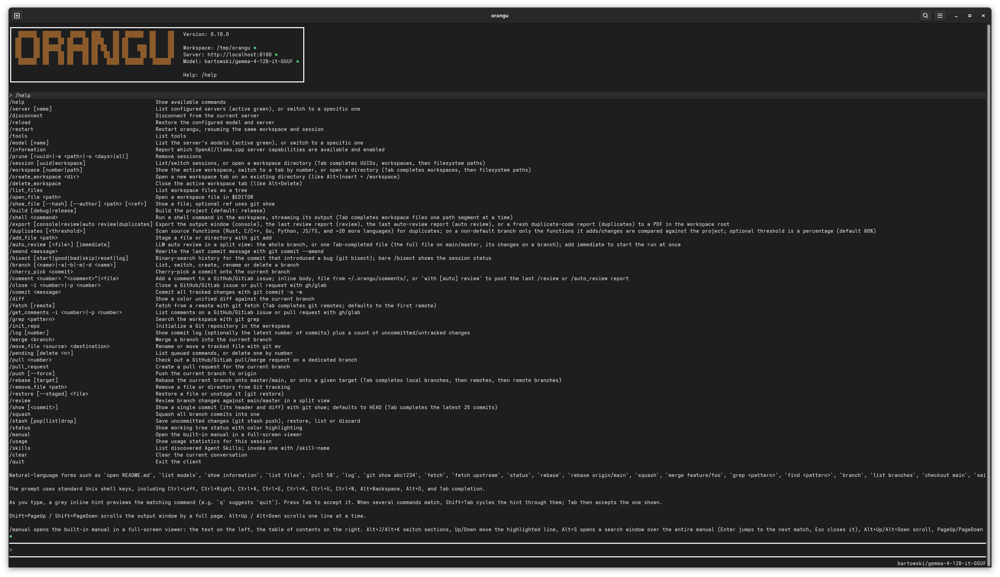
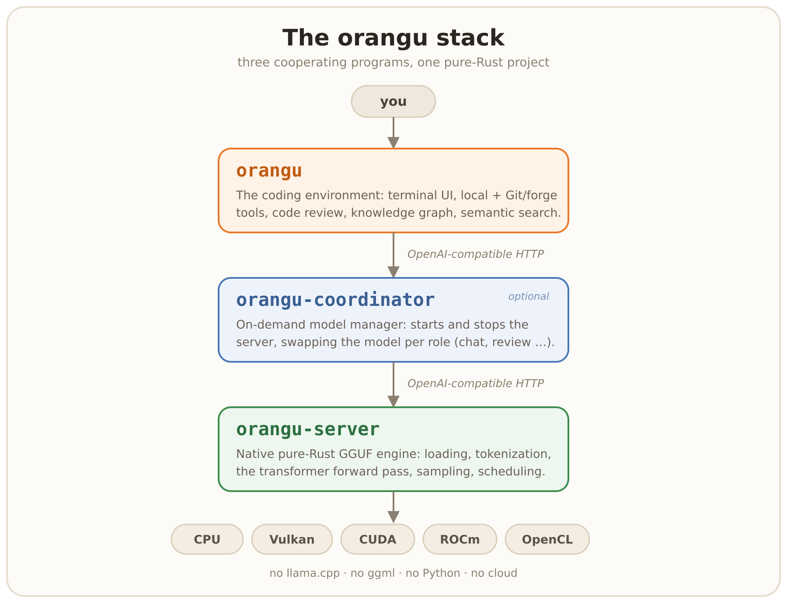

# orangu

**orangu** is a local, workspace-aware, tool-driven coding environment.

**orangu** **does not** require an Internet connection after `orangu-server` and models have been downloaded.

**orangu is a complete, self-contained AI coding stack — not just a client.** It ships all three layers, written end to end in Rust: the coding environment (`orangu`), an on-demand model manager (`orangu-coordinator`), and a **native, pure-Rust GGUF inference server** (`orangu-server`) that implements the transformer forward pass itself — **no llama.cpp, no ggml, no Python**. Every layer speaks the OpenAI-compatible API. See [A complete local AI coding stack](#a-complete-local-ai-coding-stack).

**orangu** is named after the [Orangutan](https://en.wikipedia.org/wiki/Orangutan) - the smartest ape.



## Table of Contents

- [Why orangu?](#why-orangu)
- [A complete local AI coding stack](#a-complete-local-ai-coding-stack)
- [Features](#features)
  - [Code review and auto review](#code-review-and-auto-review)
  - [The inference server](#the-inference-server)
- [orangu vs. a cloud coding assistant](#orangu-vs-a-cloud-coding-assistant)
- [Installation](#installation)
  - [One-liner install (Linux, macOS, Windows)](#one-liner-install-linux-macos-windows)
  - [Build from source](#build-from-source)
- [Configuration and first run](#configuration-and-first-run)
- [Documentation](#documentation)
- [Tested platforms](#tested-platforms)
- [Sponsors](#sponsors)
- [Contributing](#contributing)
- [Community](#community)
- [License](#license)

## Why orangu?

orangu is the lean, private, Git-centric coding companion for the terminal — built for developers who run their own models and want a tightly integrated review workflow without sending a single line of code to the cloud.

- **100% local and private** — zero telemetry; after the model is downloaded no Internet connection is needed, so it runs happily in privacy-sensitive or air-gapped environments. Your code and conversations stay on your machine.
- **Built-in code review** — an interactive two-pane reviewer (`/review`) *and* a category-by-category LLM auto-reviewer (`/auto_review`). This review story is orangu's standout feature; few tools its size match it.
- **A complete local stack, all in Rust** — orangu is more than a client. It ships its own native GGUF inference server (`orangu-server`) and an on-demand model coordinator (`orangu-coordinator`), so the whole pipeline — editor, coordinator, and engine — is one pure-Rust toolchain with **no llama.cpp, ggml, or Python dependency**. See [A complete local AI coding stack](#a-complete-local-ai-coding-stack).
- **A single fast native binary** — written entirely in Rust, with quick startup, no runtime to install, no garbage-collector pauses, and a small download.
- **The whole Git loop lives in the prompt** — branch, commit, rebase, squash, cherry-pick, stash, bisect, push, and GitHub/GitLab pull requests, comments, and issues, all without leaving the terminal.
- **Built for orangu-server** — live tokens/second in the footer, an interactive `--init` wizard that auto-detects the model your server is serving, and `/information` to probe exactly which endpoints the active server implements.
- **Agent Skills & Memory** — discovers reusable `SKILL.md` skills and merges cross-session memory and instructions from global (`~/.orangu/AGENTS.md`) and workspace-level (`./AGENTS.md`) files directly into the LLM context.
- **Builds your project too** — `/build` detects the toolchain (Cargo, CMake, Autotools, Meson, Maven, Python, Go, plain `make`) and runs format, lint, build, and test as one reported pipeline, with `debug`/`release` profiles and per-target scoping.
- **Scriptable and schedulable** — `-p` runs a single prompt or command and exits (`-q` silences it down to the exit code), and a built-in cron-style scheduler (`~/.orangu/schedule`) runs commands unattended while orangu is up.
- **Themeable terminal UI** — six built-in themes (`classic`, `modern_dark`, `modern_light`, `oranguday`, `tokyonight`, `rosepine-moon`), `random`, or your own `~/.orangu/themes/*.theme`, applied per run (`-t`) or per session (`/theme`).
- **Natural to drive** — dozens of slash commands, each with plain-English aliases (`review`, `auto review`, `commit "..."`, `merge feature/foo`, `pull 58`).

## A complete local AI coding stack

Most local-AI setups are a patchwork: one tool for the editor, a separate engine for inference, and glue to manage which model is loaded. **orangu is the whole stack in one project**, three cooperating programs written end to end in Rust:



- **`orangu`** — the workspace-aware coding environment you drive: the terminal UI, local and Git/forge tools, `/review` and `/auto_review`, the knowledge graph, semantic `/search`, and the context-compression engine.
- **`orangu-coordinator`** — an optional companion HTTP proxy that starts and stops `orangu-server` on demand and swaps to whichever model each request needs, so a single-GPU machine can use a different model per role without ever running more than one server. Skip it if you have the VRAM to keep every model resident.
- **`orangu-server`** — *is* the inference engine. GGUF loading, tokenization, the transformer forward pass, sampling, and request scheduling are implemented directly in Rust with **no dependency on llama.cpp/ggml's compiled code**, running on CPU or GPU (Vulkan, Metal, CUDA, ROCm, OpenCL). It exposes an OpenAI-compatible API plus native health/props/slots/metrics endpoints and a workspace-scoped file API, ships an optional browser chat console, and doubles as the machine's GGUF inventory (`list`/`show`/`download`/`delete`/`refresh`/`suggest`/`system`/`prune`). It can also `bundle` itself and a model into a single self-contained executable that runs with no configuration at all. See [The inference server](#the-inference-server).

Every layer talks to the next over the OpenAI-compatible API, so the pieces stay cleanly separated, yet they ship and run as one: a **fully local, fully private, single-language AI coding stack — no Python, no llama.cpp, no cloud**. The coordinator ([manual](https://github.com/mnemosyne-systems/orangu/blob/main/doc/manual/en/44-coordinator.md)) and server ([manual](https://github.com/mnemosyne-systems/orangu/blob/main/doc/manual/en/46-server.md)) each have their own chapter, with the internals documented separately ([coordinator](https://github.com/mnemosyne-systems/orangu/blob/main/doc/manual/en/76-coordinator.md), [server](https://github.com/mnemosyne-systems/orangu/blob/main/doc/manual/en/78-server.md)).

A fourth binary, `orangu-bench`, is a developer tool rather than part of the stack: it measures decode and prefill throughput of any OpenAI-compatible server over HTTP — `orangu-server` or another engine under the identical harness — and can record and chart results over time. See the [Benchmarking](https://github.com/mnemosyne-systems/orangu/blob/main/doc/manual/en/79-bench.md) chapter.

## Features

**Fully local and private.** orangu runs on its own `orangu-server`, so once the server and models are downloaded, nothing leaves your machine and no Internet connection is required. Your code is never sent to a third-party cloud.

**Code review built in.** orangu's standout feature is a pair of in-terminal review workflows — an interactive reviewer and a fully automated, LLM-driven one — covered in [Code review and auto review](#code-review-and-auto-review) below.

**Workspace-aware tooling.** Local tools show, create, modify, move, and delete files and directories, list and search (`/grep`) the tree, fetch URLs, and run shell commands (`/shell`, streamed live) — all rooted in your workspace, with paths that escape it rejected. In a Git repository the file tools make their change *with* Git (`git add`/`git mv`/`git rm`), so work is staged as it happens and nothing is ever committed behind your back. A full set of Git commands (`/status`, `/diff`, `/log`, `/show`, `/commit`, `/amend`, `/squash`, `/rebase`, `/merge`, `/cherry_pick`, `/branch`, `/stash`, `/bisect`, `/fetch`, `/restore`, `/push`, `/pull`, …) and forge integration (`/pull_request`, `/comment`, `/issue`, `/close`, `/get_comments` on GitHub and GitLab) keep the whole change-and-review loop in one place.

**Builds the project, not just the code.** `/build` detects the toolchain from the workspace root and runs the whole pipeline, reporting each step and stopping at the first failure: Rust (`cargo fmt` → `clippy` → `build` → `test`), CMake, Autotools, Meson, plain `make`, Maven, Python, and Go. It takes a `debug`/`release` profile and an optional target (a Cargo binary, a Make/Meson/CMake target, a Maven goal, a Go package), Tab-completes the targets it discovers, and reuses configured build directories so a second build is incremental.

**Advanced Context Compression Engine.** orangu protects the LLM's context window and minimizes latency using a state-of-the-art compression pipeline. Features include AST-aware file downsampling, an intelligent Git diff engine, session fingerprinting, secret redaction, and automatic transcript compaction. See the [Compression](doc/manual/en/75-compression.md) manual for details.

**Duplicate-code detection.** `/duplicates` parses every function in the workspace — across more than 20 languages (Rust, C/C++, C#, Go, Java, Python, JavaScript/TypeScript, Ruby, PHP, and more) — into a tree-sitter AST and scores each same-language pair with the Sørensen–Dice coefficient over their AST node bigrams, so functions that share a *shape* — even with different names and values — surface as similarity-ranked candidates for you to review. Save the report to a PDF with `/export duplicates`. See the [`/duplicates`](doc/manual/en/41-core_tools.md) tool.

**Multiple workspaces as tabs.** Open several projects at once in one orangu instead of one instance per project. Each workspace is a tab with its own session, scrollback, pending queue, and command history; switch with `Alt+,`/`Alt+.` or the `/workspace` command, open and close tabs with `/create_workspace <dir>` / `/delete_workspace` (or `Alt+Insert`/`Alt+Delete`), and reopen the last set of tabs at startup with `-a`/`--all`. See the [Workspaces](https://github.com/mnemosyne-systems/orangu/blob/main/doc/manual/en/31-workspaces.md) chapter.

**Agent Skills & Workspace Memory.** orangu discovers skills from four locations: `~/.orangu/skills/`, `~/.agents/skills/`, `<workspace>/.orangu/skills/`, and `<workspace>/.agents/skills/`. At startup it discloses only each skill's name, description, and `SKILL.md` location to the model. Additionally, `orangu` automatically scans for `AGENTS.md` files in your home directory and workspace root, injecting persistent project instructions and long-term memory into every chat and review session.

**Knowledge Graph & Codebase Visualization.** orangu incrementally parses your entire codebase offline using Tree-sitter, mapping every function, class, and call into a dependency graph. The AI uses this graph to instantly pinpoint the most central code symbols for any query without flooding its context window. You can also type `/graph` to instantly generate an interactive HTML visualization of the codebase architecture that opens in any browser.

**Semantic code search.** `/search <query>` retrieves code by *meaning*, not just text — a query like `where is rate-limiting handled?` surfaces a `throttle_requests` function whose name shares no words with the query. orangu embeds every symbol offline through the server's OpenAI-compatible `/v1/embeddings` endpoint, persists the vectors under `~/.orangu/workspace/<hash>/embeddings/` (re-embedding only changed files and dropping deleted ones on every search, like the knowledge graph cache), and ranks results by a hybrid of cosine similarity and the knowledge graph's call edges — a semantic seed followed by structural expansion. It enables itself automatically: tag a server `role = embeddings` (or let the default `all` server serve it), and `/search` turns on when that endpoint responds at startup — otherwise it stays dormant and retrieval falls back to `/grep` and the knowledge graph. See the [`/search`](doc/manual/en/41-core_tools.md) tool.

**Unattended and scriptable.** `orangu -p "<line>"` runs a single prompt, command, or natural-language form and exits — no terminal UI, no session on disk — streaming the answer to stdout and the timings (total, time to first token, the server's own prefill/decode figures) to stderr, so a slow server is distinguishable from a slow prompt. `-q` reduces a run to its exit code, silent until the day it fails. The built-in cron-style scheduler reads `~/.orangu/schedule` every minute and runs jobs in the active workspace tab — `0 6 * * * auto review immediate && export auto review` produces a review report each morning with nobody at the keyboard. `/schedule` lists the jobs with the next time each one fires.

**Knows how much you have been working.** `/usage` reports the current session, and `/statistics` reports persistent per-workspace activity that survives restarts — sessions, turns, tokens, LLM and tool time — folded together with the repository's own `git log` into commit totals, active-day streaks, a heatmap, and a per-author breakdown. `/statistics total` aggregates every workspace; `/export statistics` writes it to PDF.

**Comfortable terminal experience.**

- Persistent terminal UI with workspace, server, and model status in the header, refreshed every minute while idle
- Six built-in themes (`classic`, `modern_dark`, `modern_light`, `oranguday`, `tokyonight`, `rosepine-moon`), a `random` selector, and user themes from `~/.orangu/themes/*.theme` — set globally in `orangu.conf`, per run with `-t`, or per session with `/theme` (the override is stored with the session and restored on resume)
- Shell-style prompt editing, history with bash-style `Ctrl+R` reverse search (the match is ghosted inline, Tab completes it), scrolling, and context-sensitive Tab completion, with grey inline command hints (Tab accepts, Shift+Tab cycles between matches) and a slash-command dropdown
- Mouse scroll and double-click, on by default and switchable off (hold **Shift** for the terminal's own text selection)
- Natural-language aliases for nearly every command — e.g. `review`, `auto review`, `open README.md`, `list models`, `pull 58`, `commit "[#42] My feature"`, `rebase`, `merge feature/foo`, `get comments for issue 51`, `export review`
- Streaming responses with live footer status such as `Thinking (...)` and native `Working @ X.Y t/s (...)`
- Queued local commands while a response is in flight, plus double-`Esc` request cancellation
- Markdown rendering in the console (bold, italic, headings, lists, links, code) with syntax highlighting for fenced code blocks

**Share what you produce.** Export the output window, the last interactive or automated review report, a pull-request summary, the activity statistics, or a duplicate-code report to a PDF in the workspace root (`/export console`, `/export review`, `/export auto review`, `/export pr`, `/export statistics`, `/export duplicates`), or post a review straight onto an issue or pull request with `/comment <number> with review` / `with auto review`.

**Sessions and servers under your control.** Conversations are stored and resumable — `-r <uuid>` resumes one, `-l` lists every stored session as a table, `/session` lists and switches between them (or opens a directory as a new workspace), and `/prune` deletes them by id, workspace, or age. `/model` and `/server` switch model or configured server at runtime, `/information` reports which OpenAI-compatible and native endpoints the active server actually implements (plus the local knowledge-graph scan status), `/reload` returns to the configured model and server and starts a clean exchange, `/restart` re-execs orangu in place to pick up a freshly built binary without losing the session, and `/disconnect` drops the connection.

**Works offline, end to end.** Even the built-in user manual (`/manual`) — a two-pane viewer with full-text search (`Alt+S`) — is embedded in the binary at compile time, so the docs are there with no network.

### Code review and auto review

orangu turns the terminal into a code-review workstation for the changes on your current branch (committed plus local uncommitted work), measured against the merge base with the default branch. Both reviewers require the branch to be rebased up to date, so you never review against stale code.

<!-- TODO: add a screenshot or asciinema GIF of the /auto_review two-pane view (status bar + category report + file dots) here, e.g.:

A captured image sells this feature far better than prose. -->


**`/review` — interactive review.** A full-screen, two-pane view (file checklist on the right, the selected file's diff on the left, your prompt at the bottom) for reading a branch before you share it. You can:

- Mark each file approved (green) or rejected (red)
- Comment on any diff line under a chosen category (Overall, Code, Security, Memory, Performance, Test Suite, Documentation), plus whole-patch notes
- Ask the connected model about the selected file on demand (`focus on error handling`, `is this thread-safe?`) — the exchange joins your chat session for follow-up
- Open any workspace file in your `$EDITOR` without leaving the view

On exit it writes a category-grouped report with an approve/reject **Conclusion**, copies the Markdown to the clipboard, and keeps it for `/export review` and `/comment ... with review`. No `gh`/`glab` needed.

**`/auto_review` — LLM-driven review.** The model reviews the whole change and each file on its own, sorting findings into the same seven categories and marking every file approved or rejected — then summarizes the change as a whole under **Overall** and renders a final **Conclusion** verdict (`orangu approves/rejects this patch`). It is smart about effort:

- File type decides what's scanned — lock files and binary assets are auto-approved with no requests, documentation is reviewed only for the Documentation category, and source files get the full set of checks
- Per-file review depth (`Alt+m` cycles **Normal → Deep → Ignore**, or launch every file straight into Deep with the `deep` keyword): Normal is the default pass; **Deep** never truncates the diff, pulls in cross-file context from the workspace's knowledge graph (who else calls the changed code), and re-checks any rejected findings before accepting them; **Ignore** skips the file entirely and auto-approves it
- Uses a **Rigorous Review Rubric** combined with **Confidence Scoring** (0-100) to automatically filter out false positives, hallucinations, and pedantic nitpicks. It only flags high-confidence bugs that meaningfully impact correctness, security, or performance.
- A live status bar shows the current file, category, overall progress, elapsed time, and an updating time estimate; the terminal title blinks and the bell rings on completion (when `feedback` is on)
- Each finding is pinned to its `file:line`, and requests are length-capped and tool-free so reviews stay fast and bounded even on slow local models
- After the run you can browse the report, override any verdict (approve/reject with your own comment), and remove findings before exporting

Run `/auto_review <file>` to review a single file (the whole file on `main`/`master`, or just its changes on a branch), or `/auto_review all` to review every Git-tracked file in the project. `immediate` and `deep` combine with either form, or the bare command, in any order — add `immediate` to skip the pre-start phase and `deep` to start every file in Deep mode, e.g. `/auto_review all immediate`, `/auto_review deep <file>`, or `/auto_review deep all immediate` (Tab-completed and ghosted like the file argument). Like `/review`, the report is copied to the clipboard and reusable with `/export review` and `/comment ... with auto review`.

> **Tip:** You can control the chatty nature of local models using the `model_verbosity` (`terse`, `normal`, `verbose`) and `reasoning_effort` options in your `orangu.conf`. 
> The per-request length cap is `review_max_tokens` (default `512`; `0` disables it). If you review with a model that *thinks* before answering, raise it (e.g. `2048`) so the reasoning tokens don't crowd out the answer — see the [Configuration](https://github.com/mnemosyne-systems/orangu/blob/main/doc/manual/en/20-configuration.md) chapter (*Response-token caps*). Set `feedback = on` to get the blinking terminal title and completion bell during a run.

See [Core tools](https://github.com/mnemosyne-systems/orangu/blob/main/doc/manual/en/41-core_tools.md) in the manual for the full reference and key bindings.

### The inference server

`orangu-server` is the engine the rest of the stack runs on, and it is usable on its own — point any OpenAI-compatible client at it.

**Model coverage.** Text-in/text-out GGUF chat, completion, and embedding models across six architecture families: Llama-style (`llama`, `qwen2`, `qwen3`, `mistral`, and Qwen3-VL's text backbone), Gemma (`gemma`/`gemma2`/`gemma3`/`gemma4`, dense **and** the routed-expert `gemma-4-26B-A4B` MoE, plus the embeddings-only `gemma-embedding`), Qwen3.5/3.6-MoE, Qwen3.5 dense, Phi-3/Phi-4-mini, and Mistral 3. Tensors are read as `F32`/`F16`/`BF16`, `Q8_0`/`Q4_0`/`Q5_0`, the K-quants (`Q2_K`–`Q6_K`), and the I-quants (`IQ1_S` through `IQ4_XS`). Weights are dequantized lazily from the memory-mapped file, so large models fit in modest RAM, and models split across shards load from every file.

**Backends.** CPU, plus five GPU backends selected by `backend` in the config or auto-detected: **Vulkan** (the most tuned — GPU-resident weights and fused decode submissions; reaches AMD, NVIDIA, and Intel GPUs through any working driver, with no Vulkan SDK needed to build), **Metal** (that same engine and the same kernels on Apple GPUs, and the default on macOS — not a smaller port, so every Vulkan optimization is live there too), **CUDA**, **OpenCL**, and **ROCm** (behind the `rocm` Cargo feature). Every GPU backend is cross-checked in automated tests against the CPU backend's output, Metal on real Apple hardware in CI. Naming a backend explicitly fails to start rather than silently falling back to the CPU.

**Serving.** OpenAI-compatible `/v1/chat/completions` (streaming and not), `/v1/completions`, `/v1/models`, and `/v1/embeddings`, alongside native `/health`, `/props`, `/slots`, `/metrics`, `/completion`, `/tokenize`, `/detokenize`, `/apply-template`, and a loopback-only `/v1/shutdown`. Requests are scheduled across configurable slots with continuous batching, a prefix cache, and durable slot persistence so a resumed conversation need not re-prefill. Deployment roles (`--all`/`--code`/`--review`/`--explorer`/`--embedding`) adjust slot counts, sampling defaults, reasoning suppression, and which endpoints are served at all.

**Workspace file API.** Eight endpoints (`/v1/create_file`, `/v1/modify_file`, `/v1/move_file`, `/v1/delete_file`, `/v1/show_file`, and the three `*_directory` counterparts) operate inside the server's `-w`/`--workspace` root and refuse any path that escapes it — the same shared implementation the client's own file tools use, so a tool call, a typed command, and an HTTP request behave identically, staging through Git and never committing.

**Built-in web console.** Set `web` in the config for a browser chat UI on its own port: a streaming transcript with server-rendered markdown and syntax highlighting, LaTeX, live tokens/second, a Stop button, persistent chat history across restarts, file attachments (text/code, PDF, and Office/OpenDocument documents extracted to text), and a downloadable debug report. A **Models** panel shows the models directory as `orangu-server list` prints it, with per-row GGUF metadata (`show`) and delete, a Hugging Face download with live progress, and a Load button that restarts the server on a different model without dropping either listening port or the pid. Plain server-rendered HTML/CSS/JS from the same binary — no build step, no WASM, no external assets.

**Model inventory.** The same binary manages the machine's models: `list`, `show`, `download` (from Hugging Face, sharded models included), `delete`, `refresh` (re-download a model whose repository has a newer revision), `prune`, `suggest` (a size recommendation from the detected hardware), and `system` (an OS/CPU/GPU/memory report). See the [Inference server](https://github.com/mnemosyne-systems/orangu/blob/main/doc/manual/en/46-server.md) chapter.

**Single-file bundles.** `orangu-server bundle <model>` writes one executable carrying both the server and the model, memory-mapped straight out of the binary — no models directory, no download on first run, and no `orangu-server.conf`. Copy it to a machine, `chmod +x`, run it, and the API is on `127.0.0.1:8100` with the web console on `127.0.0.1:8200`. The role and the listen address are baked in too, so a `--code --host all` bundle comes up in the coding role, reachable on the network, wherever it lands — with no flags and no configuration.

```sh
orangu-server bundle unsloth/gemma-4-E2B-it-GGUF:Q4_K_M --all -y
./orangu-server-bundle-x86_64
```

## orangu vs. a cloud coding assistant

orangu makes a deliberate trade: a focused, offline-first, Git-centric terminal experience instead of a broad cloud platform. If you run your own models and care about privacy, that trade is the whole point.

| | **orangu** | **Typical cloud coding assistant** |
| --- | --- | --- |
| **Where your code goes** | Stays on your machine — zero telemetry | Sent to a third-party provider |
| **Offline use** | First-class; only the initial model download needs a network | Generally requires connectivity |
| **Models** | Any local GGUF model, served by the built-in `orangu-server` | Vendor-hosted models, usually behind API keys |
| **Cost** | Free to run against models you host | Per-token / subscription billing |
| **Footprint** | One native Rust binary, fast start, no runtime | Editor/cloud service + account |
| **Code review** | Built-in interactive **and** LLM auto review in the terminal | Usually delegated to the hosting platform |
| **Git workflow** | Full Git + GitHub/GitLab loop from the prompt | Varies; often browser-based |
| **Privacy posture** | Suited to regulated / air-gapped environments | Depends on the provider's data policy |

orangu trades breadth for simplicity, predictability, and a small attack surface. It supports a focused, tools-only integration with already-running Streamable HTTP MCP servers; broader plugin ecosystems remain outside its scope. orangu is the lean, private alternative for local models.

## Installation

### One-liner install (Linux, macOS, Windows)

**Linux / macOS** (requires `curl` or `wget`, and `tar`):

```sh
curl -fsSL https://mnemosyne-systems.github.io/orangu/install.sh | sh
```

**Windows** (requires PowerShell, included with Windows 10 and later):

```cmd
curl -fsSL https://mnemosyne-systems.github.io/orangu/install.cmd -o install.cmd && install.cmd
```

Both scripts download the latest release and install the whole stack — `orangu`, `orangu-coordinator`, `orangu-server`, and the benchmarking tool `orangu-bench` — to `~/.local/bin` (Linux/macOS) or `%USERPROFILE%\.local\bin` (Windows), and warn if the directory is not in your `PATH`.

**Custom install directory:** set `INSTALL_DIR` before running the script:

```sh
# Linux / macOS
curl -fsSL https://mnemosyne-systems.github.io/orangu/install.sh | INSTALL_DIR=/usr/local/bin sh
```

```cmd
:: Windows
set "INSTALL_DIR=C:\Tools" && install.cmd
```

**Shell completions:** after installing, run `orangu -s` to print the completion script for your shell:

```sh
# bash
orangu -s >> ~/.bashrc && source ~/.bashrc

# zsh
orangu -s >> ~/.zshrc && source ~/.zshrc

# fish
orangu -s | source
```

On Windows, add `Invoke-Expression (orangu -s)` to your PowerShell `$PROFILE`.

### Build from source

#### Install dependencies

**Fedora / RHEL:**

```sh
dnf install -y git rust cargo
```

**Debian / Ubuntu:**

```sh
apt-get install -y git curl
curl --proto '=https' --tlsv1.2 -sSf https://sh.rustup.rs | sh
```

**macOS:**

```sh
brew install rust
```

#### Release build

The following commands build an optimized release binary:

```sh
git clone https://github.com/mnemosyne-systems/orangu.git
cd orangu
cargo build --release
```

The binary will be available at:

```text
target/release/orangu
```

To install it system-wide:

```sh
sudo install -Dm755 target/release/orangu /usr/local/bin/orangu
```

#### Debug build

The following commands build a debug binary:

```sh
git clone https://github.com/mnemosyne-systems/orangu.git
cd orangu
cargo build
```

The binary will be available at:

```text
target/debug/orangu
```

## Configuration and first run

The quickest way to get a working configuration is the interactive wizard:

```sh
orangu --init
```

It asks for the **LLM URL**, auto-detects a model the server advertises (and
pre-fills it as the **Model**), then walks every option showing its default.
Anything left at its default is omitted from the file, and the result is shown
for confirmation before being written to `~/.orangu/orangu.conf` (creating the
directory if needed, and overwriting any existing file). The wizard
also installs bundled skills into `~/.orangu/skills/` when they are not
already present; currently this includes `debugging`.

Alternatively, start from the sample configuration:

```sh
cp doc/etc/orangu.conf ./orangu.conf
```

Default configuration lookup order:

1. `./orangu.conf`
2. `~/.orangu/orangu.conf`

Run the client:

```sh
orangu --config ./orangu.conf
```

Or run it directly from the build tree:

```sh
./target/release/orangu --config ./orangu.conf
```

By default, local tools operate on the current working directory. Use `--workspace /path/to/project` (`-w`) to point **orangu** at another tree.

The startup flags also have short forms: `-c` for `--config`, `-w` for `--workspace`, `-r` for `--resume`, `-a` for `--all` (reopen the last run's workspace tabs), `-t` for `--theme`, `-p` for `--prompt` (run one prompt or command and exit), `-q` for `--quiet` (print nothing on success; the exit code is the result), `-l` for `--list` (print every stored session as a table and exit), `-i` for `--init`, and `-s` for `--shell-completions`.

`-p` makes orangu usable from a script or a crontab, since a command is handled locally and never reaches the server:

```sh
orangu -p "Hello"                 # a prompt for the model
orangu -q -p "/export pr"         # writes the PDF, says nothing, exit code is the result
orangu -p "show git status"       # the natural-language form of a command
```

Shell completion scripts (bash, zsh, fish) for these flags live in [`contrib/shell/`](contrib/shell/README.md).

Useful first commands:

```text
/help
/skills
/tools
/information
/list_files
/open_file README.md
/show_file README.md
/debugging reproduce the failing request path and identify the root cause
/amend "[#42] My feature"
/cherry_pick abc1234
/commit "[#42] My feature"
/delete feature/foo
/log
/log 5
/show
/show aafd1cb
/squash
/status
/build
/graph
/search where is rate-limiting handled?
/statistics
/theme tokyonight
```

## Documentation

- [Latest manual](https://github.com/mnemosyne-systems/orangu/tree/main/doc/manual/en) — also available offline inside the binary with `/manual`
- [Getting Started](https://github.com/mnemosyne-systems/orangu/blob/main/doc/GETTING_STARTED.md)
- [orangu-coordinator](https://github.com/mnemosyne-systems/orangu/blob/main/doc/COORDINATOR.md) — auto-start/stop orangu-server for machines that only run one local model at a time
- [orangu-server](https://github.com/mnemosyne-systems/orangu/blob/main/doc/SERVER.md) — a native, pure-Rust GGUF inference server with an OpenAI-compatible API, plus CPU/GPU hardware detection and local GGUF model inventory
- [Getting started](https://github.com/mnemosyne-systems/orangu/blob/main/doc/manual/en/03-getting_started.md)
- [Configuration](https://github.com/mnemosyne-systems/orangu/blob/main/doc/manual/en/20-configuration.md)
- [Tools](https://github.com/mnemosyne-systems/orangu/blob/main/doc/manual/en/30-tools.md)
- [Workspaces](https://github.com/mnemosyne-systems/orangu/blob/main/doc/manual/en/31-workspaces.md)
- [Skills](https://github.com/mnemosyne-systems/orangu/blob/main/doc/manual/en/32-skills.md)
- [Terminal interface](https://github.com/mnemosyne-systems/orangu/blob/main/doc/manual/en/40-terminal.md)
- [Core tools](https://github.com/mnemosyne-systems/orangu/blob/main/doc/manual/en/41-core_tools.md)
- [Git tools](https://github.com/mnemosyne-systems/orangu/blob/main/doc/manual/en/42-git_tools.md)
- [Usage tools](https://github.com/mnemosyne-systems/orangu/blob/main/doc/manual/en/43-usage_tools.md)
- [Coordinator](https://github.com/mnemosyne-systems/orangu/blob/main/doc/manual/en/44-coordinator.md)
- [Inference server](https://github.com/mnemosyne-systems/orangu/blob/main/doc/manual/en/46-server.md)
- [Serving models per role](https://github.com/mnemosyne-systems/orangu/blob/main/doc/manual/en/73-openai.md)
- [Shell completions](https://github.com/mnemosyne-systems/orangu/blob/main/doc/manual/en/74-completions.md)
- [Compression](https://github.com/mnemosyne-systems/orangu/blob/main/doc/manual/en/75-compression.md)
- [Benchmarking](https://github.com/mnemosyne-systems/orangu/blob/main/doc/manual/en/79-bench.md)
- Internals: [coordinator](https://github.com/mnemosyne-systems/orangu/blob/main/doc/manual/en/76-coordinator.md), [inference server](https://github.com/mnemosyne-systems/orangu/blob/main/doc/manual/en/78-server.md), [developer information](https://github.com/mnemosyne-systems/orangu/blob/main/doc/manual/en/70-dev.md)

## Tested platforms

Continuous integration builds and runs the full test suite on every push and
pull request across all three supported operating systems, using
GitHub-hosted runners:

| Operating system | CI runner |
| :-- | :-- |
| Linux | `ubuntu-latest` |
| macOS | `macos-latest` |
| Windows | `windows-latest` |

Day-to-day development happens on [Fedora](https://getfedora.org/) 44.

## Sponsors

- [mnemosyne systems](https://www.mnemosyne-systems.ai/)

## Contributing

Contributions to **orangu** are managed on [GitHub](https://github.com/mnemosyne-systems/orangu/):

- [Ask a question](https://github.com/mnemosyne-systems/orangu/discussions)
- [Raise an issue](https://github.com/mnemosyne-systems/orangu/issues)
- [Feature request](https://github.com/mnemosyne-systems/orangu/issues)
- [Code submission](https://github.com/mnemosyne-systems/orangu/pulls)

Contributions are most welcome.

Please consult the [Code of Conduct](https://github.com/mnemosyne-systems/orangu/blob/main/CODE_OF_CONDUCT.md) before contributing.

## Community

- GitHub: [mnemosyne-systems/orangu](https://github.com/mnemosyne-systems/orangu)
- Discussions: [GitHub Discussions](https://github.com/mnemosyne-systems/orangu/discussions)

## License

[GNU General Public License v3.0](https://www.gnu.org/licenses/gpl-3.0.en.html)
